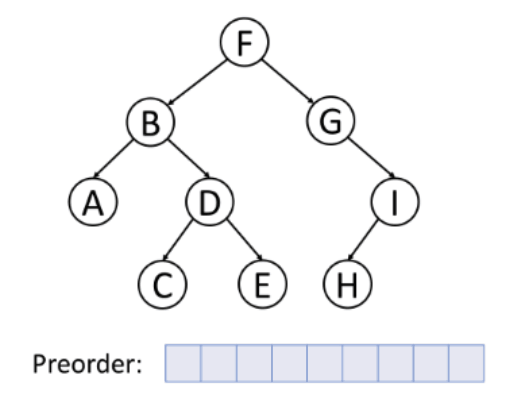

# Searching and Traversal

## Linear Search

This is a method of finding a target value in an array. This kind of algorithm sequentially checks each of the elements in an array.

**Time complexity**

- Average : O(N) -> somewhere in the middle of the array
- Best : O(1) -> first item in the array
- Worst : O(N) -> The very last element in the array

```javascript
// Searching in javascript
const beasts = ['Centaur', 'Godzilla', 'Mosura', 'Minotaur', 'Hydra', 'Nessie'];

beasts.indexOf('Godzilla');

beasts.findIndex((item) => {
  return item === 'Godzilla';
});

beasts.find(function (item) {
  return item === 'Godzilla';
});

beasts.includes('Godzilla');
```

There are more efficient ways of searching using a binary search which has logarithmic time complexity.

## Binary Search

Uses a recursive decision tree to check a sorted list. This way you discard half of the items at each decision. We don't have to check every element.

**Time complexity**

- Average : O(logN) -> somewhere in the middle of the array
- Best : O(1) -> first item in the array
- Worst : O(logN) -> The very last element in the array


# Graph and Tree Traversal

Understanding traversal is very important for more complex problems involving abstract data types.

Bread First Search (BFS) and Depth First Search (DFS) are crucially important in graph and tree traversal.

Some ideas:

- Adding attributes to each node
- Confirming properties of the data structure

### Great Resource on Traversal

- [Back to Back SWE Traversal](https://www.youtube.com/watch?v=TIbUeeksXcI)

## Breadth First Search (Queue)

**GOES WIDE**

_Time Complexity_ : O(N)

We visit every node once.

_Space Complexity_ : O(W)

W is the maximum width of the Binary Tree.

An algorithm which traverses the data structure level by level by making use of a queue data structure.


- [Breadth First Search Example Joe James](https://www.youtube.com/watch?v=E_V71Ejz3f4)

### Application

- Check if a path exists between nodes
- Finding how many levels seperate two nodes
- Find the shortest path
- Find the closest nodes

**NOTE** : _However, it requires more memory._

## Depth First Search (Stack)

**GOES DEEP**

_Time Complexity_ : O(N)

We visit every node once.

_Space Complexity_ : O(H)

H is the maximum height of the Binary Tree.

An algorithm which starts at some node or vertex and explores as far as possible along each path before backtracking. DFS makes use of a LIFO stack to traverse the data structure in this manner.

Actually it should be noted that inorder, postorder and preorder BST traversals are all DFS traversal algorithms.


### Application

- Backtracking
- Complete search ie. DOES THE PATH EXIST?
- Exhausting possible paths
- Less memory

**NOTE** : _Can get slow_

In relation to Binary Search Trees the different types of traversals are actually DFS algorithms.



## Example questions

- If you know the solution is not far from the root : _BFS_
- If the tree is very deep and solutions are rare : _BFS_ (DFS will take too long)
- If the tree is very wide : _DFS_ (better memory management)
- If the solutions are frequent but located deep in the tree: _DFS_
- Does a path exist? _DFS_
- Shortest path? _BFS_

## Dijkstra Algorithm

_Time Complexity_ : O((E+V)log(V))

The algorithm exists in many variants. Dijkstra's original algorithm found the shortest path between two given nodes, but a more common variant fixes a single node as the "source" node and finds shortest paths from the source to all other nodes in the graph, producing a shortest-path tree.

### USE CASE

- DFS doesn't take into account the weighting of different edges.


- [Dijkstra Algorithm Wiki](https://en.wikipedia.org/wiki/Dijkstra%27s_algorithm)

[Dijkstra Algorithm Explanation](https://www.youtube.com/watch?v=pVfj6mxhdMw)

## Bellman-Ford Algorithm

_Time Complexity_ : O(EV)

In graph theory this algorithm is a Single Source Shortest Path (SSSP) algorithm.

### USE CASE

- Can accomodate for negative weights
- Detect negative cycles

### DRAW BACKS

- Takes longer then Dijkstra's algorithm

[Bellman Ford Algorithm Explanation](https://www.youtube.com/watch?v=lyw4FaxrwHg)

## Resources

- [Joe James Youtube Traversal](https://www.youtube.com/watch?v=tlPuVe5Otio&t=44s)
- [Differences between BFS and DFS](https://www.geeksforgeeks.org/difference-between-bfs-and-dfs/#:~:text=The%20Time%20complexity%20of%20BFS,and%20E%20stands%20for%20edges.)
- [Example questions](https://www.youtube.com/watch?v=LMH1l2pR8Us)
- [Visual Algo Graph Traversals](https://visualgo.net/en/dfsbfs)
- [Dijkstra and Bellman-Ford Algorithms](https://visualgo.net/en/sssp)
