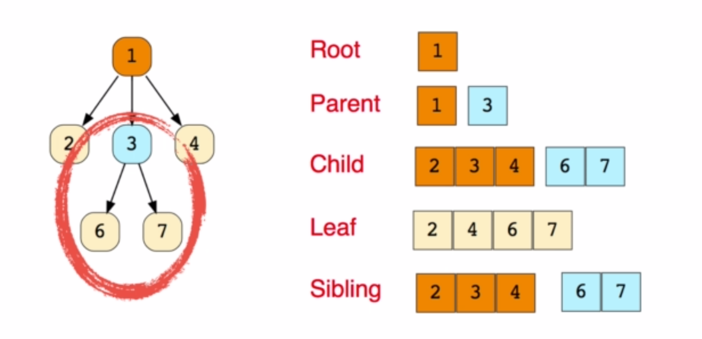
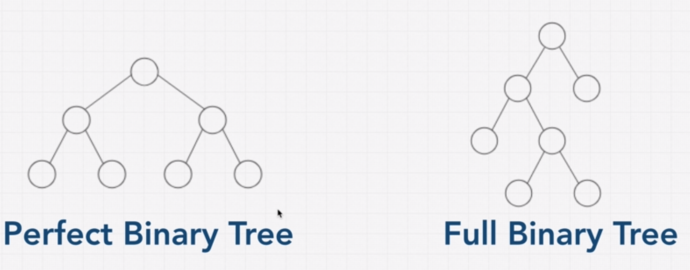

# Trees

Computers use tree data structures to decide upon the best movement in chess. Tree data structures are everywhere.

They are also a **Directed Acyclic Graph (DAG)**, which is very useful in implementing Breadth First Search and Depth First Search.

### Implementation

- the root or head of the tree has all the other nodes as childrens
- parents always point towards their children
- binary trees have atmost 2 children per node
- leaf nodes have no children
- trees can be implemented using recursion

### Applications

- file directory
- abstract syntax tree
- DOM in internet browsers is a tree
- comments and posts

## Binary Tree

- each node can have 0, 1 or 2 children
- the left subtree has every element less then the root of the tree
- the right subtree has every element greater then the root of the tree
- the number of nodes doubles at each level
- Perfect Binary Tree has the property that the number of nodes in the bottom level is equal to the sum of all the other nodes in the tree plus one.

### Perfectly Balanced Binary Tree

- they are much faster then an unbalanced trees (which have O(N) operations)

#### Number of nodes per level

- Level 0 : 1
- Level 1 : 2
- Level 2 : 4
- Level 3 : 8

#### Properties

- PROPERTY : TOTAL NODES = 2^H - 1,

  (where H = height)

PROOF : 8 = (4 + 2 + 1) + 1

- TOTAL NUMBER OF DECISIONS = log(TOTAL NODES)

PROOF : 3 = log(8)

**Note**: log(N) means that on each decision the search space is reduced

### Types of tree

- Perfect Binary Tree (balanced) [link - visual algo BST](https://visualgo.net/bn/bst)
- Full Binary Tree (0 or 2 children)

### PROS AND CONS

They are decent at everything (O(log(N) operations across the board if the tree is balanced)

#### PROS

- Search and lookup is very easy (most operations are O(N))
- Relationships and order are preserved
- Flexible size

#### CONS

- Insert and delete is slower then a hashtable
- No O(1) operations
- **Unbalanced binary search trees** slow down lookup operations. This is because they basically reduce to linked list data structures.

### AVL Red/Black Trees

#### AVL

- ensures the tree is balanced
  [link - visual algo AVL](https://visualgo.net/bn/avl)

#### Red/ Black Trees

- ensures the tree is balanced
  [link - visual Red/Black Tree](https://www.cs.usfca.edu/~galles/visualization/RedBlack.html)
